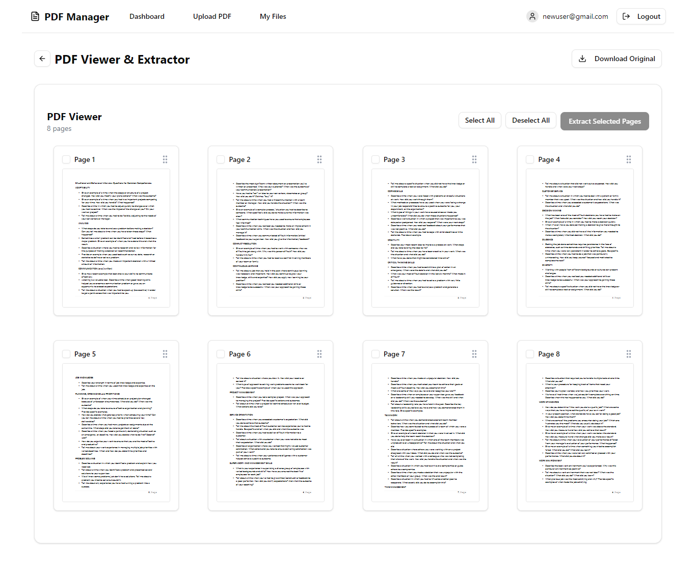
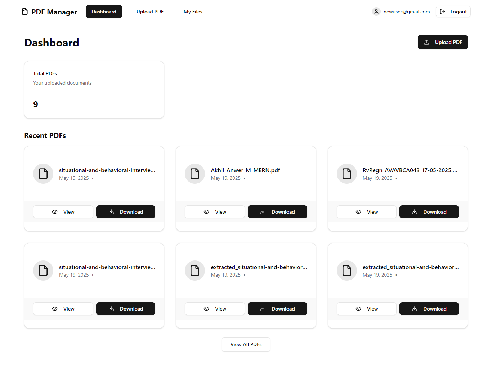

# PDF Kit

PDF Kit is a web application that allows users to upload PDF files, view their pages, select specific pages, rearrange their order, and extract them into a new PDF for download. Built with a modern tech stack, it features user authentication, responsive design, and seamless PDF manipulation. The project is hosted live at [https://pdf-kit.vercel.app](https://pdf-kit.vercel.app).

## Features

- **User Authentication**: Secure login with access and refresh tokens using JWT.
- **PDF Upload**: Upload PDF files (up to 10MB) to the server, stored in AWS S3.
- **PDF Viewing**: Display a visual representation of all pages in the uploaded PDF.
- **Page Selection**: Select specific pages to include in the new PDF using checkboxes.
- **Page Rearrangement**: Drag and drop pages to reorder them before extraction.
- **PDF Extraction**: Create a new PDF with selected pages and download it.
- **Responsive Design**: Fully responsive UI, optimized for mobile and desktop devices.
- **File Management**: View and manage all uploaded PDFs in a user-friendly interface.

## Tech Stack

- **Frontend**: Next.js, React, TypeScript, Tailwind CSS, Shadcn UI, react-pdf, @dnd-kit
- **Backend**: Node.js, Express, TypeScript, MongoDB, AWS S3
- **Authentication**: JSON Web Tokens (JWT)
- **Deployment**: Vercel (frontend), [Backend hosting TBD]

## Screenshots

*Add screenshots here to showcase the UI (e.g., upload page, PDF viewer, file list). To include screenshots:*

1. Place images in a `screenshots/` folder in the repository.
2. Update this section with Markdown image links, e.g.:

```markdown



```

*Current placeholders (replace with actual images):*

- Upload Page: *TBD*
- PDF Viewer: *TBD*
- File List: *TBD*

## Prerequisites

- **Node.js**: v18 or higher
- **MongoDB**: A running MongoDB instance (local or cloud, e.g., MongoDB Atlas)
- **AWS Account**: For S3 storage (access key, secret key, bucket, and region)
- **Git**: To clone the repository
- **npm**: For package management

## Setup

### 1. Fork and Clone the Repository

1. Fork the repository on GitHub: *[Insert GitHub repo URL here, e.g., https://github.com/username/pdf-kit]*.
2. Clone the forked repository:

```bash
git clone https://github.com/your-username/pdf-kit.git
cd pdf-kit
```

### 2. Environment Variables

Create `.env` files in both the `server` and `client` directories with the following variables:

**`server/.env`:**
```
PORT=5000
MONGODB_URI=mongodb://localhost:27017/pdf-kit
JWT_SECRET=your_jwt_secret
JWT_REFRESH_SECRET=your_jwt_refresh_secret
AWS_ACCESS_KEY_ID=your_aws_access_key
AWS_SECRET_ACCESS_KEY=your_aws_secret_key
AWS_REGION=your_aws_region
S3_BUCKET=your_s3_bucket_name
FRONTEND=http://localhost:3000
```

**`client/.env`:**
```
NEXT_PUBLIC_API_URL=http://localhost:5000
```

*Notes:*
- Replace placeholders (e.g., `your_jwt_secret`, `your_aws_access_key`) with actual values.
- Ensure `MONGODB_URI` points to your MongoDB instance.
- `FRONTEND` should match the client URL (update for production).
- `NEXT_PUBLIC_API_URL` should point to the backend API (update for production).

### 3. Install Dependencies

**Server:**
```bash
cd server
npm install
```

**Client:**
```bash
cd client
npm install
```

### 4. Configure PDF Worker (Client)

The client uses `react-pdf`, which requires a PDF worker script. Ensure the correct version (`pdfjs-dist@5.2.133`) is used:

```bash
cd client
Remove-Item public\pdf.worker.min.mjs
Copy-Item node_modules\pdfjs-dist\build\pdf.worker.min.js public\pdf.worker.min.mjs
```

This ensures compatibility with `react-pdf@9.2.1`.

## Running the Project

### Server

Navigate to the `server` directory:

```bash
cd server
```

- **Development** (with hot reloading):
```bash
npm run dev
```
- **Build** (compiles TypeScript to JavaScript):
```bash
npm run build
```
- **Production** (runs compiled code):
```bash
npm start
```

The server will run on `http://localhost:5000` (or the specified `PORT`).

### Client

Navigate to the `client` directory:

```bash
cd client
```

- **Development** (with Turbopack):
```bash
npm run dev
```
- **Build** (creates optimized production build):
```bash
npm run build
```
- **Production** (runs built app):
```bash
npm start
```

The client will run on `http://localhost:3000`.

### Access the App

1. Open `http://localhost:3000` in your browser.
2. Sign up or log in to access the dashboard.
3. Upload a PDF, view pages, select/rearrange pages, and extract a new PDF.


## Troubleshooting

- **PDF Worker Mismatch**: If you see a version mismatch error for `react-pdf`, ensure `pdfjs-dist@5.2.133` is enforced in `client/package.json`:
  ```json
  "resolutions": {
    "pdfjs-dist": "5.2.133"
  }
  ```
  Then re-run the PDF worker copy command.

- **MongoDB Connection**: Ensure MongoDB is running and `MONGODB_URI` is correct. Test with `mongo` CLI or MongoDB Compass.

- **AWS S3 Errors**: Verify `AWS_ACCESS_KEY_ID`, `AWS_SECRET_ACCESS_KEY`, `AWS_REGION`, and `S3_BUCKET` are valid. Check AWS IAM permissions for S3 access.

- **TypeScript/ESLint Issues**: Run `npm run lint` in `client` or `server` to check for errors. Fix with `npm run lint -- --fix`.

- **React 19 Compatibility**: The client uses `react@19.0.0`. If issues arise with `react-pdf` or other libraries, test with `react@18`:
  ```bash
  cd client
  npm install react@18 react-dom@18
  ```

